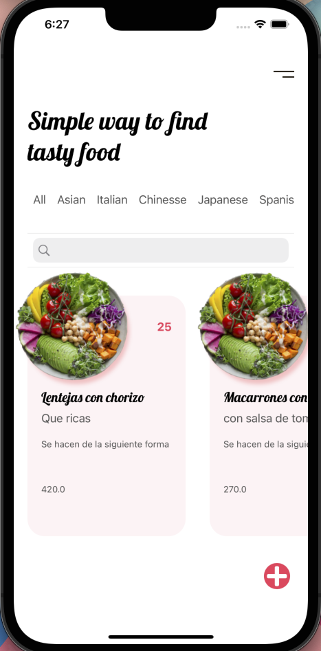
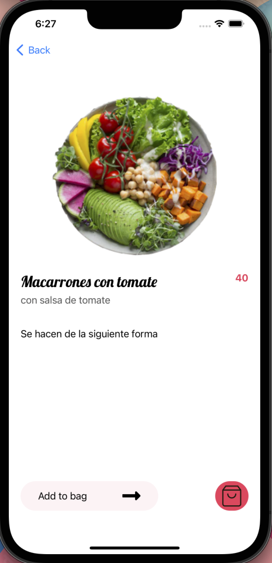

# Food App in UIKit

App creada en UIKit con arquitectura MVVM.

La aplicación consta de una pantalla principal con un CollectionView en horizontal donde se muestran distintos ejemplos de recetas. 

Se puede filtrar por tipo de comida según el país y navegar al detalle donde se mostraría la receta.

